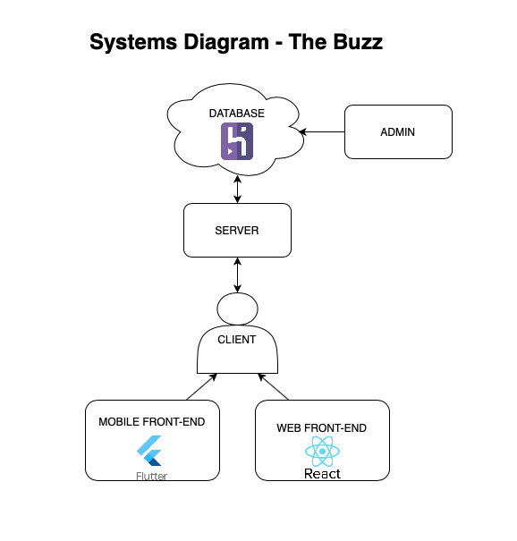
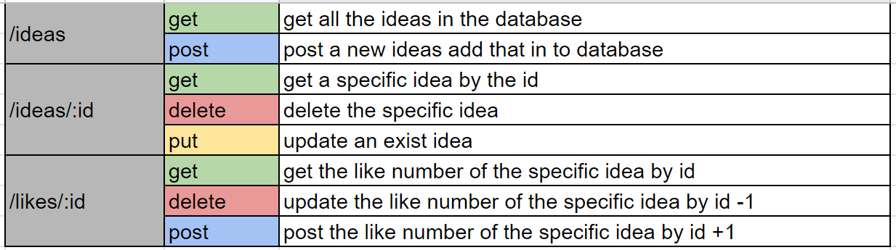
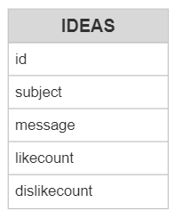

# CSE 216
This is Team Fourteam's repository. It is intended for use during phase 1.

## Details
- Semester: Fall 2022
- Student ID: jub424
- Bitbucket Repository: https://bitbucket.org/junchenbao/cse216_fl22_group14/src/master/README.md?mode=edit&at=master

## Trello invitation link
https://trello.com/invite/b/MEsnAxxj/0745274807676a41afc93408ecbc6a7e/team-fourteam-phase-1

## Contributors
1. Junchen Bao
2. Ala Chua
3. Na Chen
4. Gerardo Hernandez Macoto
5. Alex Guataipu

# Artifacts
## System Architecture Diagram

## Routes

## Entity Diagram

## User Stories
- Anonymous User
	- As a user, I want to create and save posts, so that I can share my ideas
	- As a user, I want to interact with other posts, so that I can like and dislike ideas
	- As a user, I want to see other posts, so that I can view other users' ideas
	- As a user, I want to post on mobile or web, so that I can access data on different platforms
	- As a user, I want to edit a post, so that I can change my idea
- Admin
	- As an admin, I want to create and drop a table, so that I can manage posts
	- As an admin, I want a command-line interface, so that I can interact with and manage ideas
	- As an admin, I want to create other routes, so that I can send data to the front-end
## User State Machine

	

